<div align="center">

# Frame<span>.</span>

**Fit any photo into any social format — losslessly — then turn your photos into a video with music.**
Everything runs in your browser. No photo or audio ever leaves your machine.

[](LICENSE)


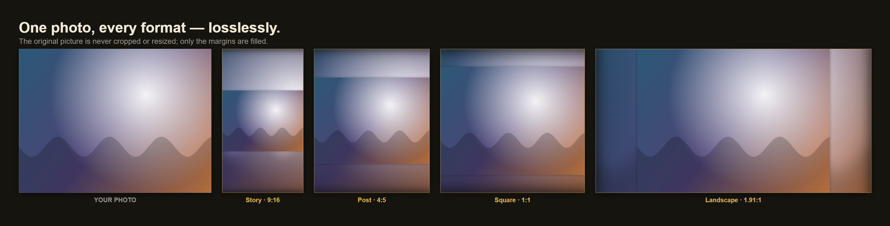

</div>

---

## What is Frame?

Tall or wide photos don't fit neatly into a square Instagram post, a 9:16 Reel, or a 16:9 YouTube frame — platforms crop them. **Frame solves this without cropping:** it grows the canvas to the target shape and fills the new margins with colors drawn from the photo itself, leaving your original picture **completely untouched**.

Then it can string those photos into a **video slideshow** with motion, transitions, title cards, and your own music — exported as an MP4 directly in the browser.

Two workspaces, one app:

| ▦ **Frame photos** | ► **Make a video** |
|---|---|
| Turn each photo into a social-ready image with filled margins, saved as a lossless PNG. | Arrange photos into a slideshow with music, captions, motion, and transitions. |

### See it in action

The **original picture stays untouched** — only the new margins are filled (here with the *Blurred photo* style). A wide photo into a 9:16 Story, and a tall photo into a 1:1 Post:

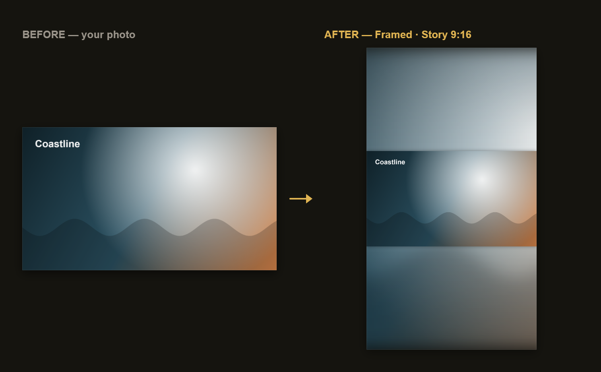

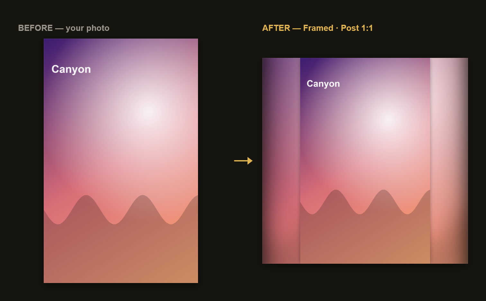

---

## The one promise: your pixels are never touched

This is the invariant the whole app is built around and **continuously tested against real Chromium**:

- Your photo is drawn into the canvas at a **1:1 pixel scale** with image smoothing **off** — never resized, cropped, or resampled.
- Only the *new margin area* is ever painted.
- If a photo already matches the target shape, downloading hands you back **the original file, byte-for-byte** — same format, same metadata.
- Otherwise you get a **lossless PNG**.
- The in-app **Verify** button re-checks any photo live and proves the picture region is bit-identical to your upload.

> Platforms still recompress on upload — that's outside any tool's control — but the file *you* hand them here is pristine.

---

## Features

### 🖼️ Framing
- **7 platforms, 30+ presets** — Instagram, TikTok, YouTube, X, Facebook, LinkedIn, plus **Custom** any-ratio.
- **8 side-fill styles** — Matched edges, Stretch, Mirror, Blurred photo, Frosted, Color gradient, Duotone, Solid color (auto/black/white/pick).
- **Edge shading** to softly deepen the frame edges.
- **"Show where the original sits"** guide overlay (never added to the download).
- **Saveable presets** — save a favorite fill + settings combo and one-click apply it.
- **Batch** — drop many photos at once and download them all.

### 🎬 Video slideshow
- **Drag-reorder** clips, **zoom** the timeline, **snap** audio to cuts.
- **Per-clip overrides** — motion, color look, and outgoing transition per clip (or set global defaults).
- **Motion** — Still, Zoom in, Zoom out, Pan.
- **Transitions** — Cut, Crossfade, Fade black, Slide, Slide up, Wipe, Iris.
- **Color looks** — None, Warm, Cool, Mono, Vivid.
- **Title / text cards** with custom background & text colors.
- **Captions** per clip, alpha-crossfaded through transitions.
- **Clips up to 10 minutes** each, with an editable length field.
- **Save any frame as a PNG** — e.g. a Reel cover that exactly matches the video.

### 🔊 Audio
- **Multiple tracks** on independent lanes, positioned anywhere.
- **Per-track volume**, **fade in / out**, and **auto-duck under voice**.
- **Voiceover recording** straight from your microphone.
- **"Match clips to music"** to line the video up with a track.

### 📤 Export
- **Fast export** via **WebCodecs** (H.264 + AAC), muxed by [Mediabunny](https://www.npmjs.com/package/mediabunny) — a 60s video exports in seconds, fully **offline**.
- Honest **real-time recording fallback** on browsers without WebCodecs (and it says so).
- **Heads-up before export** — estimated file size, resolution, quality, and whether your music lines up with the video length.
- **Live progress with time-left**, and a **Cancel** that cleanly aborts.

### 🔒 Privacy & platform
- **100% client-side** — nothing is uploaded, ever.
- **Session autosave** to IndexedDB (settings + original media + timeline), restored behind an explicit bar on next visit.
- Ships as a **web app**, an installable **PWA**, and a **desktop app** (Windows / macOS) via Electron.

---

## Screenshots

### The workspace
Sidebar to switch between framing and video; drop photos and see them framed instantly.

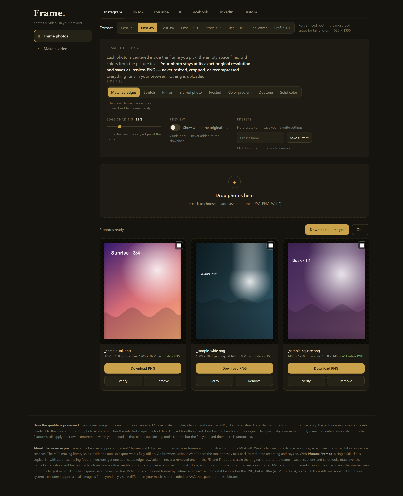

### Pick a platform & format
Instagram, TikTok, YouTube, X, Facebook, LinkedIn, or a Custom ratio — each with its real dimensions.

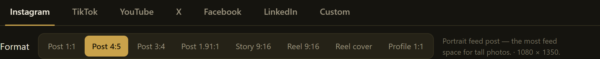

### Choose how the margins are filled
Eight fill styles, edge shading, a preview guide, and saveable presets.

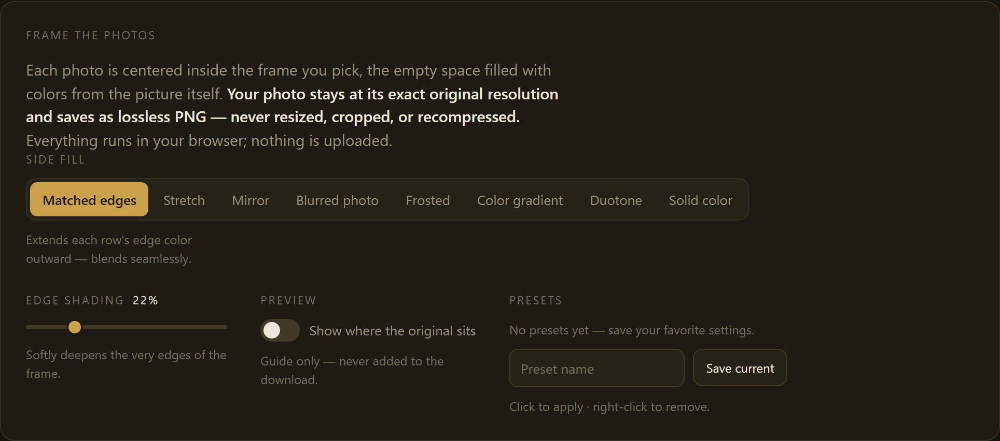

### Every photo, framed and lossless
Each card shows the framed result, the exact dimensions, and a lossless-PNG (or untouched-original) badge — plus **Verify**.


### See exactly where your original sits
The optional guide overlays the untouched picture region — never part of the download.

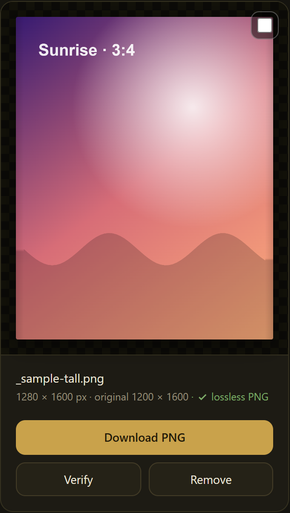

### Build a video
Live preview, a draggable timeline, motion / transition / look / quality controls.

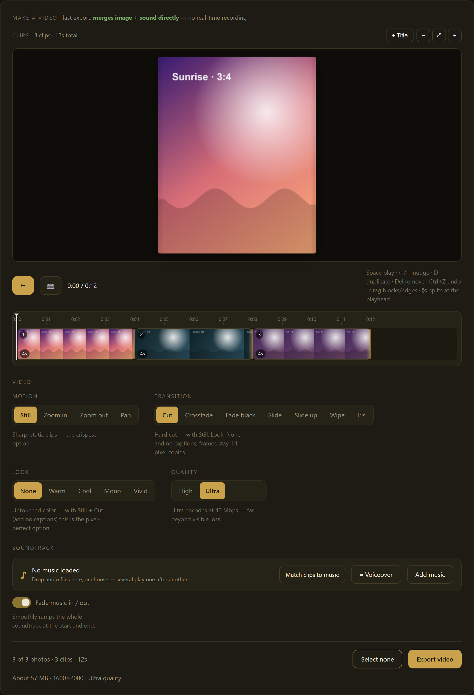

### Add music, fades & ducking
Independent audio lanes with volume, fade in/out, and duck-under-voice — and a heads-up when the music doesn't fill the video.

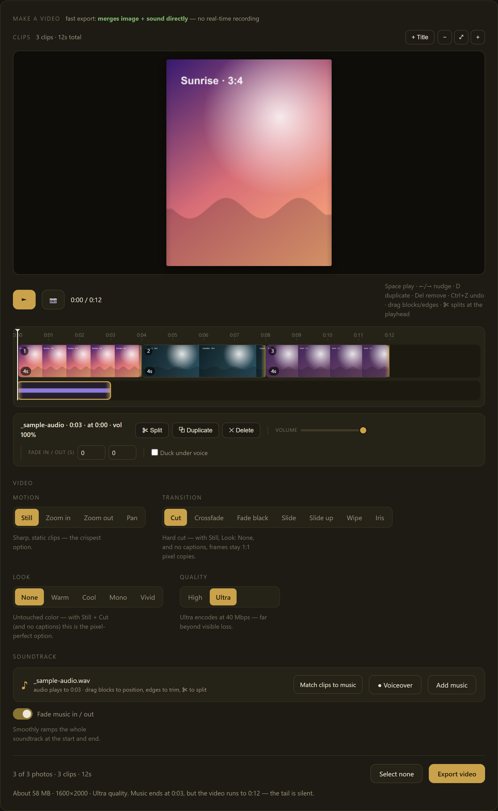

### Fine-tune each clip
Select any clip for length, order, duplicate/delete, per-clip motion/look/transition, and a caption.

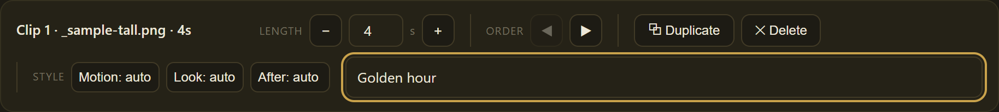

### Title & text cards
Drop in title cards with your own colors between photos.

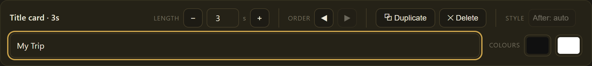

### Per-photo: Framed or Original
Photos added on the **Frame** tab default to framed; photos added on the **Make a video** tab default to the untouched original — flip any one with a toggle.

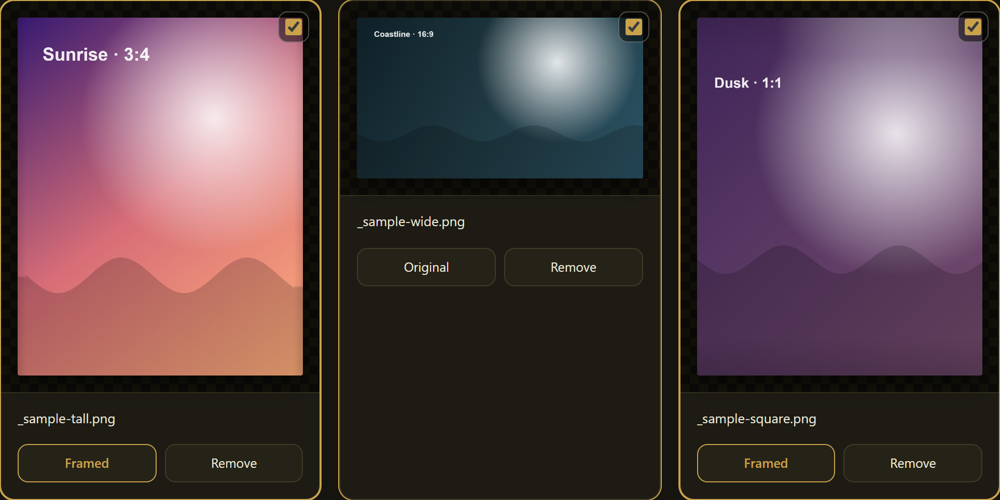

### Know before you export
A plain-language heads-up: rough size, resolution, quality, and whether the soundtrack fits.


---

## Supported formats

| Platform | Presets |
|---|---|
| **Instagram** | Post 1:1, Post 4:5, Post 3:4, Post 1.91:1, Story 9:16, Reel 9:16, Reel cover, Profile 1:1 |
| **TikTok** | Video 9:16, Photo 3:4, Profile 1:1 |
| **YouTube** | Shorts 9:16, Video 16:9, Thumbnail 16:9, Banner 16:9, Profile 1:1 |
| **X** | Post 16:9, Post 1:1, Header 3:1, Profile 1:1 |
| **Facebook** | Post 1.91:1, Post 1:1, Story 9:16, Cover 2.63:1, Profile 1:1 |
| **LinkedIn** | Post 1.91:1, Post 1:1, Cover 4:1, Profile 1:1 |
| **Custom** | Any width × height |

---

## Quick start

Requires **Node 18+** and a recent **Chrome / Edge** (for WebCodecs fast export).

```bash
git clone https://github.com/ali-dev178/frame.git
cd frame
npm install
npm run dev            # web app at http://localhost:5173
```

### Desktop (Electron)

```bash
npm run dev:desktop    # the same app inside an Electron window (hot reload)
npm run dist           # build an installer into release/
npm run smoke:desktop  # verify the WebCodecs export pipeline in packaged Electron
```

### Build for the web / PWA

```bash
npm run build          # typecheck + production build into dist/
npm run preview        # preview the production build
```

---

## Download (desktop)

Grab the installer for Windows or macOS from the
[Releases](https://github.com/ali-dev178/frame/releases) page.

### ⚠️ The builds are unsigned — here's what that means

Code-signing certificates cost money every year (Apple's Developer Program is
~$99/yr; Windows certificates are ~$200–600/yr). Frame is a **free, open-source
project**, so paying for signing isn't worth it — the installers are shipped
**unsigned**. That's completely safe (every build is produced in public by
GitHub Actions straight from this source code — you can read exactly what runs),
but your OS will show a scary-looking warning the first time. Here's how to get
past it:

**Windows** — SmartScreen shows *"Windows protected your PC"*:
1. Click **More info**.
2. Click **Run anyway**.

**macOS** — Gatekeeper says the app *"can't be opened"* or is *"from an
unidentified developer"*:
1. **Right-click** (or Control-click) the app → **Open**, then **Open** again in the dialog; **or**
2. Open **System Settings → Privacy & Security**, scroll down, and click **Open Anyway** next to the Frame message.

You only have to do this once per install.

### Prefer not to trust a binary? Run from source

Everything runs the same locally — no build needed to just use it:

```bash
git clone https://github.com/ali-dev178/frame.git
cd frame && npm install
npm run dev:desktop    # the desktop app, or `npm run dev` for the browser
```

---

## How to use it

1. **Drop photos** onto the Frame tab (JPG, PNG, WebP — several at once).
2. **Pick a platform and format** in the top bar (e.g. Instagram → Reel 9:16).
3. **Choose a side-fill style** and tweak edge shading; save a preset if you like the combo.
4. **Download** each image (lossless PNG, or your original untouched) — or **Download all**.
5. Switch to **Make a video**, tick the photos you want, and arrange them on the timeline.
6. Add **motion, transitions, a look, title cards, captions**, and your **music**.
7. **Export** — a heads-up shows the size and fit; then a fast MP4 (or real-time fallback) with live progress.

> On iPhone, set **Camera → Formats → "Most Compatible"** (or convert to JPG/PNG) — browsers can't decode HEIC. Frame tells you clearly if a file couldn't be opened.

---

## Browser support

| Capability | Chrome / Edge | Safari | Firefox |
|---|---|---|---|
| Framing & lossless PNG | ✅ | ✅ | ✅ |
| Fast MP4 export (WebCodecs) | ✅ | ⚠️ partial | ❌ |
| Real-time recording fallback | ✅ | ✅ | ✅ |

Frame **detects capabilities at runtime** and tells you honestly which path it will use before you export.

---

## Architecture

No UI framework — imperative DOM + canvas, TypeScript, Vite. [`CLAUDE.md`](CLAUDE.md) documents the internals in depth.

```
src/
├── main.ts          entry point
├── state.ts         settings (S) + app collections + selectors
├── core/            config, layout, colors, naming, IndexedDB, project autosave
├── render/          margin fills, framed-canvas builder, single frame renderer
├── audio/           Web Audio scheduling, fades, offline mixdown
├── export/          capability probe, WebCodecs fast path, MediaRecorder fallback
├── platform/        the only browser-vs-desktop split (save adapter)
└── ui/              dom, controls, cards, studio, timeline, soundtrack, presets, restore
electron/            desktop shell (window + IPC + smoke probe)
```

Key ideas:
- **One frame renderer** (`drawAtTime`) powers the live preview, the fast exporter, and the recording fallback — *what you preview is exactly what exports*.
- **UI is generated from config arrays** — add a format, fill, motion, or transition by extending an array in `src/core/config.ts`.
- **Two export engines**, prefers fast, falls back honestly.

---

## Testing

```bash
npm test                                   # all tests once
npm run test:watch                         # watch mode
npx vitest run tests/unit/layout.test.ts   # a single file
```

- **Unit tests** (`tests/unit/`) run in Node.
- **Browser tests** (`tests/browser/`) run in real headless Chromium via Playwright (`npx playwright install chromium` if missing).
- **`tests/browser/lossless.test.ts`** enforces the pixels-are-untouched invariant for every fill mode and **must stay green**.

### Regenerating the screenshots

```bash
npm run dev                 # serve the app on :5173
node scripts/shots.mjs      # captures docs/screenshots/*.png with generated sample media
```

---

## Releases

Push a `v*` tag → GitHub Actions builds Windows (NSIS) and macOS (dmg/zip, universal, unsigned) installers and attaches them to a GitHub Release. Each build first runs a WebCodecs smoke probe inside packaged Electron on that OS, so an installer only ships if fast export actually works there.

---

## Contributing

Contributions are welcome! Please:

1. Open an issue to discuss substantial changes first.
2. Keep the **lossless invariant** intact — `tests/browser/lossless.test.ts` must stay green.
3. Run `npm test` and `npm run typecheck` before opening a PR.
4. Match the existing imperative DOM + canvas style (no framework).

See [CONTRIBUTING.md](CONTRIBUTING.md) for details.

---

## Privacy

Frame is **fully client-side**. Your photos, audio, and videos are processed entirely in your browser (or the desktop app) and **never uploaded anywhere**. Session data is stored only in your browser's local IndexedDB.

---

## License

[MIT](LICENSE) © 2026 Muhammad Ali

<sub>`instagram-frame-tool.html` at the repo root is the original single-file prototype, kept as a frozen historical baseline. The live app is `index.html` + `src/`.</sub>
